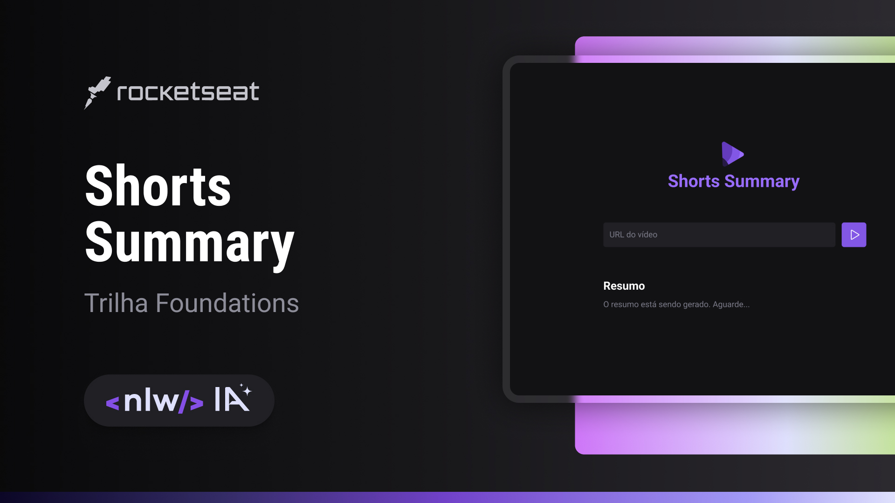

<h1 align="center"> Shorts Summary </h1>

Evento exclusivo e gratuito, promovido pela Rocketseat para ensino de tecnologias WEB.

  <a href="#-tecnologias">Tecnologias</a>&nbsp;&nbsp;&nbsp;|&nbsp;&nbsp;&nbsp;
  <a href="#-projeto">Projeto</a>&nbsp;&nbsp;&nbsp;|&nbsp;&nbsp;&nbsp;
  <a href="#-layout">Layout</a>&nbsp;&nbsp;&nbsp;|&nbsp;&nbsp;&nbsp;
  <a href="#memo-licença">Licença</a>

  

 

  

## 🚀 Tecnologias

Esse projeto foi desenvolvido com as seguintes tecnologias:

- HTML e CSS
- JavaScript e Node.js
- Express e Axios
- Inteligênica Artificial
- Git e Github
- Figma

## 💻 Projeto

O Shorts Summary é um projeto de resumo de vídeos shorts do youtube, a partir da transcrição do áudio do mesmo, com a utilização de IA;

## 🔖 Layout

Você pode visualizar o layout do projeto através [DESSE LINK](https://www.figma.com/file/jQVNBdxp1A9g5SKDqwl98q/Shorts-Summary-%E2%80%A2-Trilha-Foundations-(Community)?type=design&node-id=301%3A171&mode=dev). É necessário ter conta no [Figma](https://figma.com) para acessá-lo.

## :memo: Licença

Esse projeto está sob a licença MIT.

---

Feito com ♥ by Shelldon Ryan and Rocketseat :wave: [Participe da nossa comunidade!](https://discord.gg/rocketseat)